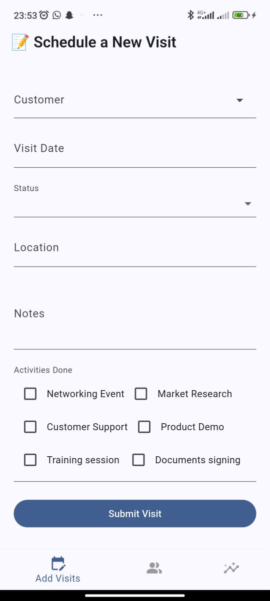
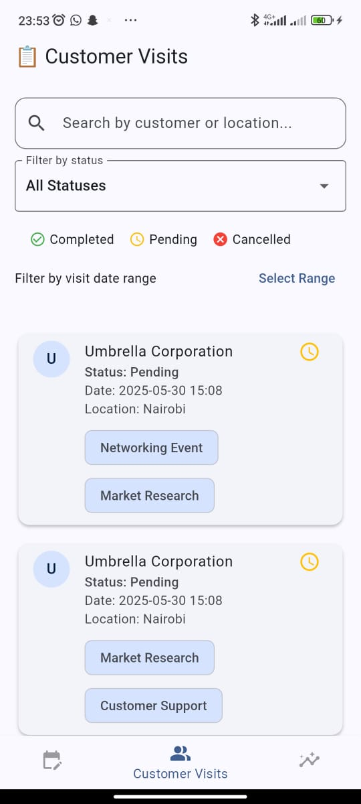
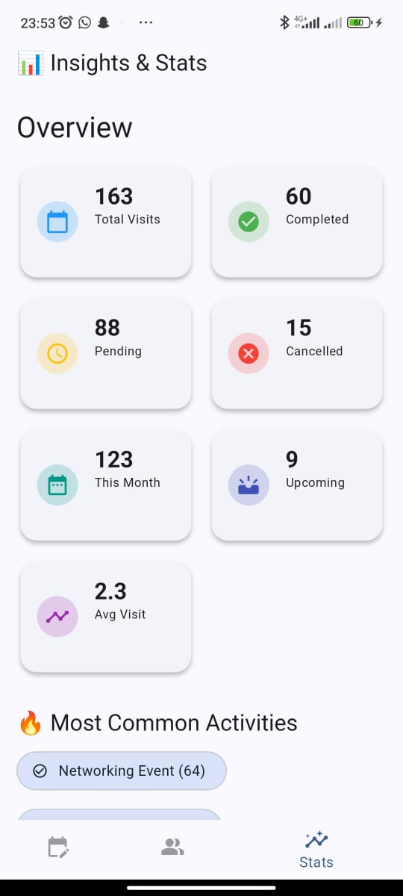
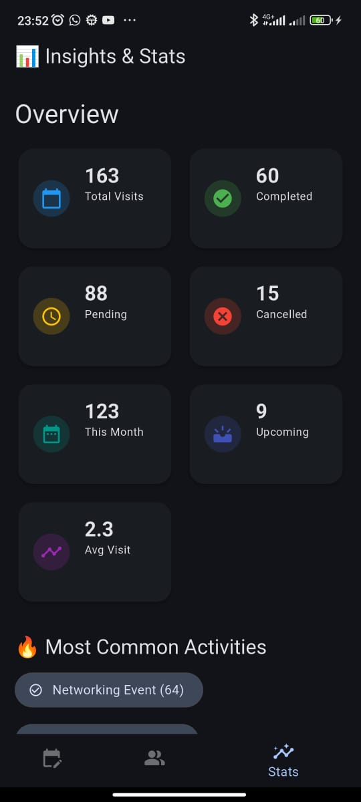

# Solutech Technical Assessment App

This Flutter application is designed to manage and track customer visits and associated activities in a clean, efficient, and user-friendly manner. It implements various screens including:

- Add Visit Form
- View Customer Visits with filters and search
- Track Activities via visual insights
- Statistics Dashboard with visit analytics

---

## Screenshots

### Add Visit Form


### Customer Visits List


### Statistics Dashboard


### Add Visit Form Dark Mode


### Customer Visits List Dark Mode


### Statistics Dashboard Dark Mode

---

## Architectural Overview

To ensure maintainability, testability, and clean separation of concerns, the app is structured using the following layers:

### **1. Services**
Handles direct API communication. This includes:
- Sending HTTP requests
- Encoding/decoding JSON
- Managing headers

### **2. Repository**
Provides an abstraction over the service layer, allowing the controller or notifier to remain unaware of the API implementation. This improves testability and decouples business logic from networking concerns.

### **3. Controllers (State Notifiers)**
Implemented using **Riverpod’s StateNotifier**, controllers handle business logic and state management for features like:
- Fetching visits
- Posting new visits
- Filtering and transforming state

### **4. Providers**
These declare the actual Riverpod providers (e.g., `StateNotifierProvider`, `FutureProvider`) and expose state to the UI.

### **5. UI**
Composed of feature-driven screens and widgets (e.g., `AddVisitsScreen`, `CustomerVisitsScreen`), the UI layer is reactive to state changes provided by Riverpod.

> I chose Riverpod because of its simplicity, robust typing, and excellent testability.

---

## 🚀 Setup Instructions

Follow these steps to run the app locally:

### 1. Clone the Repository

```bash
git clone https://github.com/your-username/solutech_technical_assessment_app.git
cd solutech_technical_assessment_app
```

### 2. Install Dependencies

```bash
flutter pub get
```

### 3. Set up Environment
Create a .env file in the root directory with the following content:
```bash
API_KEY=your_api_key_here
```


### 4. Run the app
```bash
flutter run
```

### **Running Unit Tests**

### 1.  Where Tests Live
All test files are located inside the /test directory, for example:
```bash
test/
├── activities/
│   ├── activity_notifier_test.dart
│   └── mock_activity_repository.mocks.dart
```

### 2. Run All Tests
In your terminal, from the root of the project:
```bash
flutter test
```

### 3. Generating Mocks with Mockito
This project uses the Mockito package for mocking dependencies like repositories.
Before running tests that depend on mocks, generate them using:
```bash
flutter pub run build_runner build
```
The test involves classes annotated with @GenerateMocks, like this:
```bash
@GenerateMocks([ActivityRepository])
```
The mock_activity_repository.mocks.dart will be auto-generated.

### **Assumptions, Trade-offs, and Limitations**
- The app assumes stable network connectivity during API operations.

- All visit and activity data is fetched fresh from the backend.

- Filtering is performed locally after data is loaded, which may not scale well with very large datasets.

- Some fields like created_at are assumed to be handled by the backend unless explicitly passed in the request.


